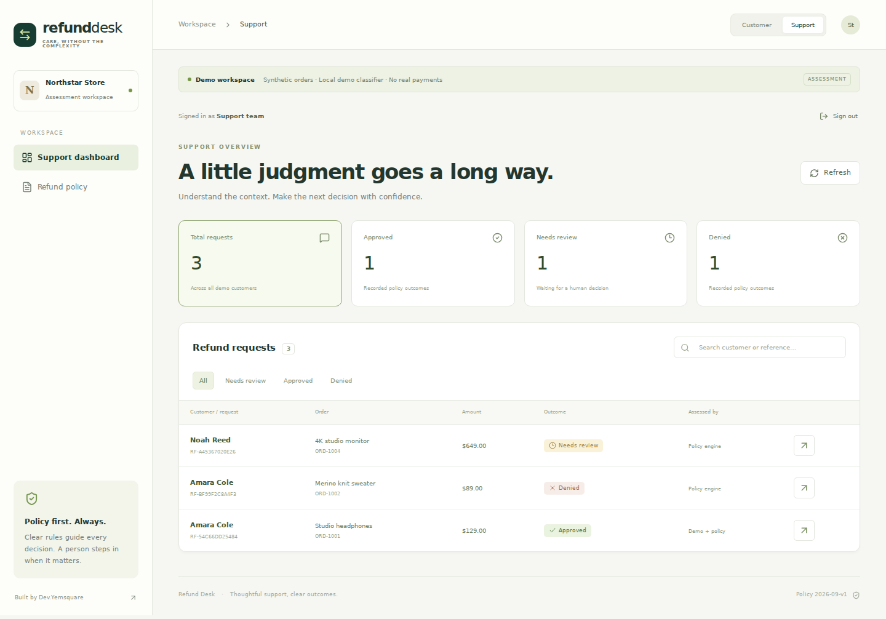
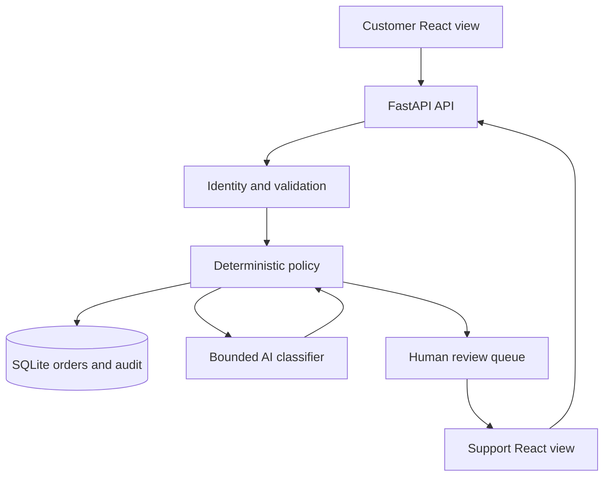

# Refund Desk

**Clear decisions. Thoughtful support.** A containerized full-stack assessment for WORKNOON, built by Dev.Yemsquare.

Refund Desk processes synthetic e-commerce refund requests using a deterministic policy engine and an optional, structured AI classifier. It includes a React customer experience, a support dashboard, human review, and an audit trail.



[View the customer experience](docs/screenshots/customer.png) · [Successful container verification](https://github.com/Yemsquare/worknoon/actions/runs/36700181925)

## Run in one command

Install Docker Desktop (including Docker Compose), then from the repository root:

```bash
docker compose up --build
```

Open **http://localhost:8080**. Subsequent launches: `docker compose up` (legacy Compose installations may use `docker-compose up`). The first build needs internet access to download dependencies and images.

- Customer view: select one of 15 fictional profiles. Each has two seeded orders.
- Support view: local demo password **`support-demo`**.
- Demo mode works without an API key; it is a conservative, deterministic classifier, **not a live LLM**.
- The frontend and backend run in separate containers. SQLite and seeded mock data live in a persistent named volume inside the backend; a third database container is intentionally unnecessary.
- Only the frontend is exposed, bound to `127.0.0.1`. The backend is reachable only within the Compose network.
- Approved means a recorded policy decision. **No real payment or refund is executed.**

## Enable live AI

Copy `.env.example` to `.env` (PowerShell: `Copy-Item .env.example .env`). Set:

```dotenv
AI_MODE=live
OPENAI_API_KEY=your-own-api-key
OPENAI_MODEL=gpt-4.1-mini
```

Then recreate the backend:

```bash
docker compose up --build -d
```

Keep `.env` private. The API key stays on the backend and is never bundled into the frontend. The model is configurable; choose an available model that supports Chat Completions and strict JSON Schema structured outputs. Live requests can incur provider charges.

For a live test, use **Amara Cole → ORD-1001 → Damaged item** with “My headphones arrived with a cracked ear cup.” The support details must show `mode: live`. Hard policy exclusions and amounts above $500 skip the model entirely. Missing credentials, timeouts, refusals, truncation, or invalid output produce **Escalated**, with `mode: unavailable`; there is no silent demo fallback in live mode.

The health endpoint reports the configured mode and key presence, not whether a live model call has succeeded. Confirm live mode in the individual request audit/classification details.

Provider contract reference: [OpenAI structured outputs](https://developers.openai.com/api/docs/guides/structured-outputs).

## Architecture



**Request lifecycle:** authenticate → validate ownership/input → reserve the order and idempotency key in a transaction → check hard policy → classify if needed → apply deterministic rules → persist decision and audit event → show the result. AI calls happen outside database write transactions. An interrupted processing request is recovered into human review at application startup.

| Layer | Implementation |
| --- | --- |
| UI | React, Vite, responsive custom CSS, Lucide icons |
| API | FastAPI, Pydantic input/output validation for AI, HTTP bearer sessions |
| Policy | Pure Python functions; versioned policy and rule IDs |
| AI | Direct server-side OpenAI HTTP call; strict JSON Schema and local validation |
| Data | SQLite, parameterized queries, foreign keys, unique order reservation, WAL |
| Containers | Python non-root API; Node build stage; unprivileged Nginx static frontend/proxy |
| Tests | Pytest API/policy/security tests; browser smoke checks |

## Policy assumptions

The exercise provides example rules but leaves their precedence and refund window unspecified. This implementation documents these choices:

1. Final-sale items are denied (P01).
2. Orders older than 30 calendar days are denied (P02). Day 30 is included; dates use UTC.
3. Previously refunded orders are denied (P03).
4. Inconsistent future dates and suspicious requests are escalated (P06).
5. Refunds **above** $500 are escalated (P04). Exactly $500 can be automatically approved.
6. Damage/incorrect-item claims can be approved if classification agrees with the declared reason, is not suspicious, and has confidence at least 0.85 (P05).
7. Unclear, conflicting, changed-mind and other claims are escalated (P06).

Model confidence is self-reported, not a calibrated risk score. A production threshold needs evaluation against a labelled dataset. Claimed damage is not independently verified; a real retailer should add evidence/fraud checks. A model misclassification can affect an eligible low-value claim, but cannot override hard exclusions or the $500 review threshold.

Support can approve or deny an escalated request with a required note. Hard exclusions are checked again before manual approval. Policy version and initial rule ID remain on the record; a human-review audit event records the final change.

## API reference

| Method | Endpoint | Access / purpose |
| --- | --- | --- |
| GET | `/api/health` | Configuration and database health |
| GET | `/api/policy` | Versioned refund rules |
| GET | `/api/demo/customers` | Synthetic picker; disabled outside demo mode |
| POST | `/api/auth/customer` | Demo identity session |
| POST | `/api/auth/admin` | Support password session |
| GET | `/api/orders` | Current customer's orders only |
| POST | `/api/requests` | Submit request; `Idempotency-Key` required |
| GET | `/api/requests` | Current customer's request history |
| GET | `/api/admin/requests?status=All` | Support queue with classifications and audit notes |
| POST | `/api/admin/requests/{id}/review` | Resolve an escalation with a note |

The direct development API exposes OpenAPI at http://localhost:8000/docs. Compose exposes `/api/*` through Nginx; Swagger UI is not proxied by default.

All monetary values are integer cents. Customers cannot submit an amount, status, customer ID, or policy override in the refund payload. Bearer tokens are HMAC-signed, have a one-hour lifetime, and remain in React memory (refresh signs out). The support role is verified on every protected request. No cookie session is used.

## Security boundaries and trade-offs

- This is a **local assessment**, not a production identity or payment system. Demo customer impersonation is deliberate and prominently labelled. Do not expose the demo publicly.
- `DEMO_MODE=false` disables the customer picker and demo login. Startup requires a 32+ character `AUTH_SECRET` and 16+ character `ADMIN_PASSWORD`. Real customer access then requires an identity-provider integration; disabling demo mode alone does not add production authentication.
- Production needs OIDC/MFA, per-agent identity, server-side revocation, stronger fraud/evidence checks, secret management, TLS, persistent distributed rate limiting, durable payment integration, and a data-retention policy.
- Prompt-injection patterns are defense in depth, not a complete detector. The model receives only the untrusted claim, no customer profile, tools, secrets, or database access. Its schema has no decision field. The backend owns policy and amounts. React escapes displayed text; HTML is never interpreted.
- AI output is bounded and validated. Only category, confidence, suspicious flag, and a concise claim summary are accepted. Audit notes are decision summaries, not hidden model chain-of-thought.
- API bodies are capped at 16 KiB; messages at 2,000 characters. Login/submission rate limits are in-memory and per process. Behind Compose's proxy the login limit is shared, which is acceptable for this single-user demo.
- One request per order prevents duplicate decisions. Same idempotency key plus same payload returns the original completed result; changed payload or concurrent in-flight submission returns 409. This assessment does not implement re-opening or partial refunds.
- SQLite and startup recovery assume **one API process**. For multiple replicas use PostgreSQL, migrations, request leases, background jobs, and distributed locks/rate limits.
- Audit events are append-only through the application, but are not tamper-proof against direct database access. They persist in the Docker volume.
- No blanket retry of chargeable model calls. On provider errors, human review is the safe next step.
- Only the last 500 requests are shown in the support endpoint; production needs pagination and indexed search.
- Seed order dates are relative to first startup and persist. To reset the synthetic dataset, intentionally remove the demo volume: `docker compose down -v` (this deletes all local demo history).

## Development without Docker

Python 3.12+ and Node.js 24 are recommended. From the repository root:

```bash
python -m venv .venv
# macOS/Linux
source .venv/bin/activate
# Windows PowerShell instead:
# .venv\Scripts\Activate.ps1
pip install -r backend/requirements.lock
cd backend
uvicorn app.main:app --host 127.0.0.1 --port 8000
```

In another terminal:

```bash
cd frontend
npm ci
npm run dev -- --host 127.0.0.1
```

Open http://localhost:5173. Vite proxies `/api` to the Python API. For live AI without Docker, export `AI_MODE`, `OPENAI_API_KEY`, and `OPENAI_MODEL` into the backend process environment; `.env` is automatically consumed by Compose only.

## Verification

```bash
cd backend
python -m pytest -q
cd ../frontend
npm ci
npm run build
```

See [docs/VALIDATION.md](docs/VALIDATION.md) for the actual verification evidence and remaining gates, [docs/DEMO.md](docs/DEMO.md) for the walkthrough script, and [docs/REFUND_POLICY.md](docs/REFUND_POLICY.md) for the policy document.

## Project layout

```text
backend/app/       API, identity, policy, AI adapter and database
backend/tests/     Behaviour and security tests
frontend/src/      Customer and support interfaces
docs/              Policy, architecture notes, validation and demo guide
scripts/           Optional local browser verification
docker-compose.yml One-command local environment
.env.example       Configuration template, no real secrets
```

## Submission checklist

- [x] Public repository with frontend/backend source
- [x] Approximately 15 mock customer profiles and order histories
- [x] Documented policy, approval/denial/escalation flow and support dashboard
- [x] Docker Compose configuration and setup instructions
- [x] API/policy tests and frontend production build
- [x] Build and run Docker Compose on a Docker-enabled GitHub CI runner
- [ ] Supply your own API key and verify one real live-model classification
- [x] Record a captioned local browser walkthrough in demo mode
- [ ] Review the walkthrough and explain your own engineering decisions
- [ ] Email the repository and video links to WORKNOON before its stated deadline

The assessment permits AI development assistance. This implementation was prepared with assistance; review it, run it, and be ready to explain the trade-offs during the technical interview.
